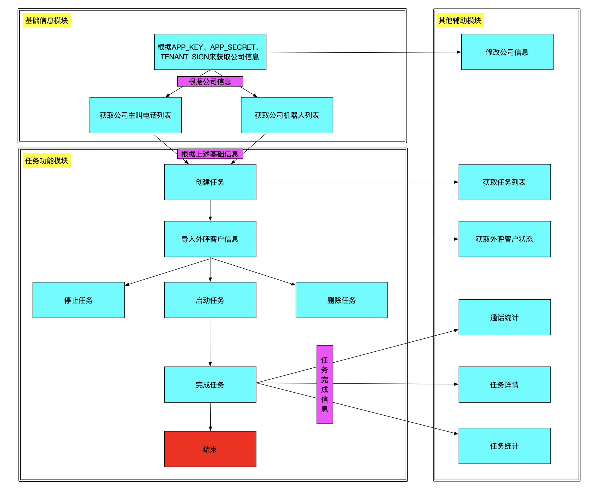

# 简介

探意机器人API文档1

这是探意机器人API文档，具体详情查看每个API接口调用说明；

如果有问题，欢迎联系我们客服，技术支持

公司官网地址 ：http://www.yiwise.com/


# 开发引导

## 调用说明

第一种方式：主动调用 这种调用方式是客户主动调用接口获取数据或实现功能；

主动调用需在请求头传入APP_KEY、APP_SECRET、VERSION（当前版本的VERSION=v1）、TENANT_SIGN（公司签名，后期提供修改）和验签字段signature用于权限校验；

注意：请在开发对接程序前联系探意技术支持进行注册，如果你还未签约，请先签约开通账户。

第二种方式：方法回调 这种调用方式是当达到预设条件如：任务完成或通话结束时，由探意主动向指定地址发送信息；

注意：请在开发前自主配置好回调地址。

探意机器人API是使用HTTP并遵循REST原则设计的Web服务接口；

您可以使用几乎任何客户端和任何编程语言与REST API进行交互。

通过发送简单的HTTP请求就可以轻松接入使用。

调用方式分为两种：主动调用和方法回调。


## 权限认证

> 认证密钥样例

```java
  APP_KEY = "WtSMaXXXXXXXXtvy";
  APP_SECRET = "aXSFnnZbHXXXXXXXXXXXXXXXMguz1Q";    
  TENANT_SIGN = "yiwisexxxx";    
```

API认证采用SHA256加密算法进行加密，使用时间戳、APP_KEY、APP_SECRET、VERSION（当前版本的VERSION=v1）和 TENANT_SIGN（公司签名，后期提供修改）共同生成一个验签字段signature。

目前已有完成JAVA版的样例，具体实现请下载SDK查阅。


> 请在API样例`openapidemo`中替换为自己的APP_KEY、APP_SECRET和 TENANT_SIGN.

探意为确保您的账户和信息安全，请在开发对接程序前联系探意技术支持注册接口调用专属密钥。

<aside class="notice">
您必须替换对接密钥 <code>APP_KEY 、 APP_SECRET 和 TENANT_SIGN </code>在您的对接程序中 
</aside>

## 统一请求格式

URL格式：

<code>/{version}/{resource}/{function}</code>

说明： 

{version}api版本号

{resource}为资源名，通常对应一类API

{function}为该资源提供的操作方法

请求响应的结果为json格式

>比如查询公司列表的url为：
  
```请求URL样例  
<code>http://apiOpen/v1/tenant/getTenant </code> 表示调用公司信息的get方法，并且返回json格式的字符串。

我们目前已经提供的接口，请参考API。 

```

HTTP头信息:

<code>Accept:application/json;charset=utf-8</code>

说明：

请求方式(Method)：统一用GET/POST方式，编码：UTF-8

>

##JAVA SDK DEMO 下载

本页面提供Java的SDK下载。

SDK包内有部分使用说明，各接口的详细使用说明请浏览各API详情页。

如探意未提供您使用语言的SDK，您可以根据API文档开发接口

语言 | GitHub地址 
--------- | ------- 
JAVA | [GitHub地址](https://github.com/yiwise/openapidemo.git) 

##最佳实践流程图:

 

##常见问题解答

1. Q: 定时任务和手动任务的异同

  A: 异步，定时任务在设定好启动时间和结束时间时会在到达指定时间时自动启动
    手动任务则需要导入客户之后手动启动任务；
    
    同步，任务到达12-14点或指定暂停时间会自动暂停，并且会占用AI并发量。
    
2. Q: isv账号能否操作多个crm账号下的任务
  
  A: 一个APP_KEY和APP_SECRET目前只能操作一个CRM的账户，CRM暂无子公司这个概念

##流程说明

###第一部分:

主要是获取公司相关信息，为创建任务提供数据。

这里一共三个接口分别查询到：

1.公司Id

2.公司的主叫电话号码列表

3.机器人话术相关参数：机器人话术id

###第二部分:

核心业务部分，主要是任务的创建，启动，停止等操作。

1.创建任务
    创建任务过程中需要传入的几个重要的值：机器人话术id,这个值不能传入有误，传入出错会导致任务拨打有误
2.任务启动
    只有手动任务才需要手动去启动任务，自动任务是自动启动的。 
<aside class="notice">
任务恢复：任务在未完全暂停（子任务还没有全部运行完成），是不能恢复的
</aside>
  
3.任务暂停
    任务在运行中，可调用暂停任务让任务进入暂停状态（可再次运行），并且是在所有当前正在跑的子任务都运行完成之后才会暂停
4.终止任务
    任务终止，终止之后不可以恢复

###第三部分:

任务运行结束，调用任务回调接口，将本次任务信息发送到指定回调地址。

###第四部分:

主要是查询任务相关信息。
 
##枚举类型说明

### 电话卡类型枚举
 
type    | desc 
--------- | ------- 
MOBILE | 手机 
LANDLINE | 阿里云固话 
UNFIXED_CALL | 无主叫固话

### 任务类型枚举

type    | desc 
--------- | ------- 
AUTO | 自动任务
MANUAL | 手动任务 

### 任务状态枚举

type    | desc 
--------- | ------- 
NOT_STARTED | 未开始
IN_PROCESS | 进行中 
COMPLETED | 已完成
RUNNABLE | 可运行
USER_PAUSE | 用户暂停
SYSTEM_SUSPENDED | 系统暂停
TERMINATE | 已终止
IN_QUEUE | 排队中

### 通话结果枚举

type    | desc 
--------- | ------- 
ANSWERED | 已接听
NO_ANSWER | 呼叫号码未接听
BUSY | 呼叫号码占线
POWER_OFF | 呼叫号码关机
OUT_OF_SERVICE | 呼叫号码停机
REFUSED | 呼叫号码拒接
VACANT_NUMBER | 呼叫的号码是空号
CAN_NOT_CONNECT | 呼叫的号码无法接通
FROM_PHONE_ERROR | 主叫号码不可用
SYSTEM_ERROR | 外呼失败

### 意向等级枚举

type    | desc 
--------- | ------- 
A | 较强
B | 一般
C | 无法判断
D | 很少
E | 需要再次跟进
F | 无需再次跟进


## 错误码信息

错误码 | 错误信息
---------- | -------
200|执行成功
401|校验数据错误
404|资源未找到
403|权限不足
412|参数错误
500|未知错误


#最近更新日志
##2018年10月10日第一版本
一、公司信息接口

  1. 获取公司信息接口
  
  2. 获取公司的主叫电话列表接口
  
  3. 获取公司的机器人话术列表接口

二、任务操作接口

  1. 创建任务接口
  
  2. 启动任务接口
  
  3. 暂停任务接口
  
  4. 终止任务接口
  
  5. 删除任务
  
  6. 向任务中导入客户接口
  
  7. 修改任务AI坐席数（任务并发数）

三、任务信息接口

  1. 获取任务列表接口

  2. 获取任务详情接口

  3. 获取已经完成任务电话号码接口

  4. 获取一个通话的详情接口

四、信息回调接口

  
